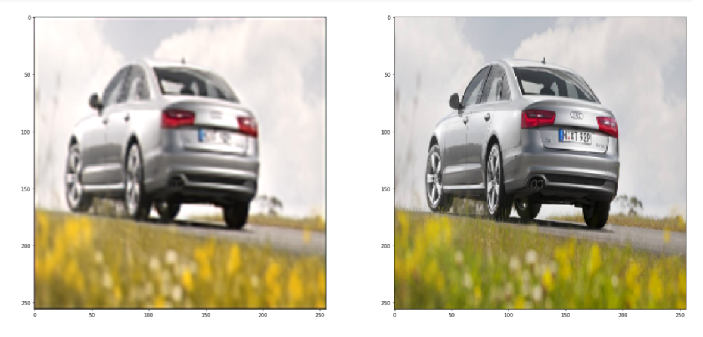

# Image Super Resolution using AutoEncoder
> In this project, I have used Keras with Tensorflow as its backend to train the autoencoder, and use this deep learning powered autoencoder to significantly enhance the quality of images. That is, the neural network will create high-resolution images from low-res source images.

# Results

